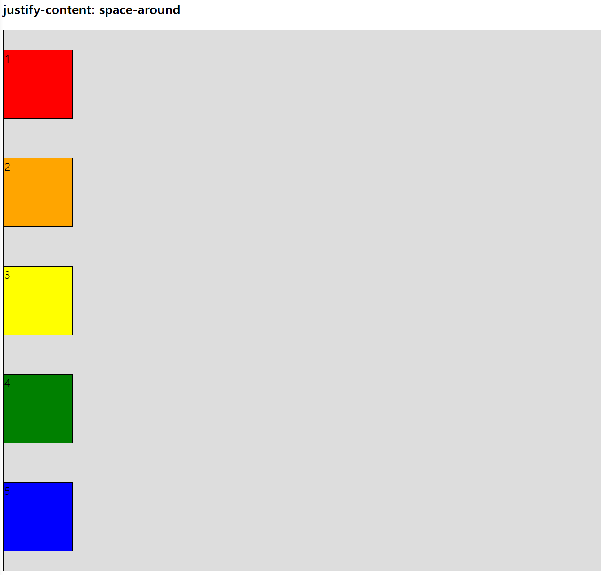
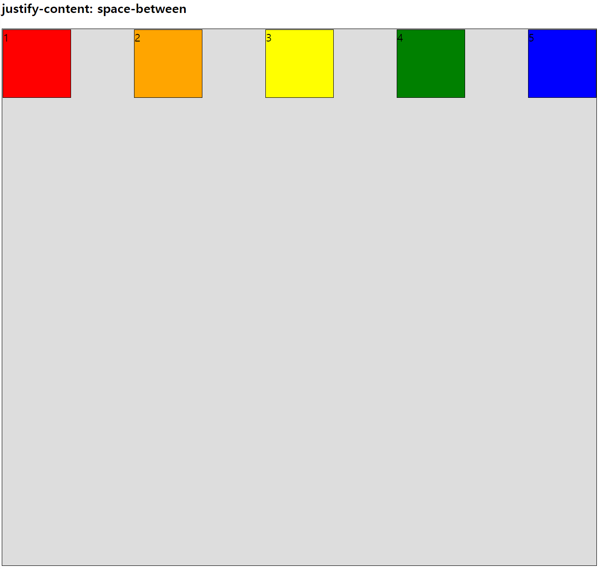
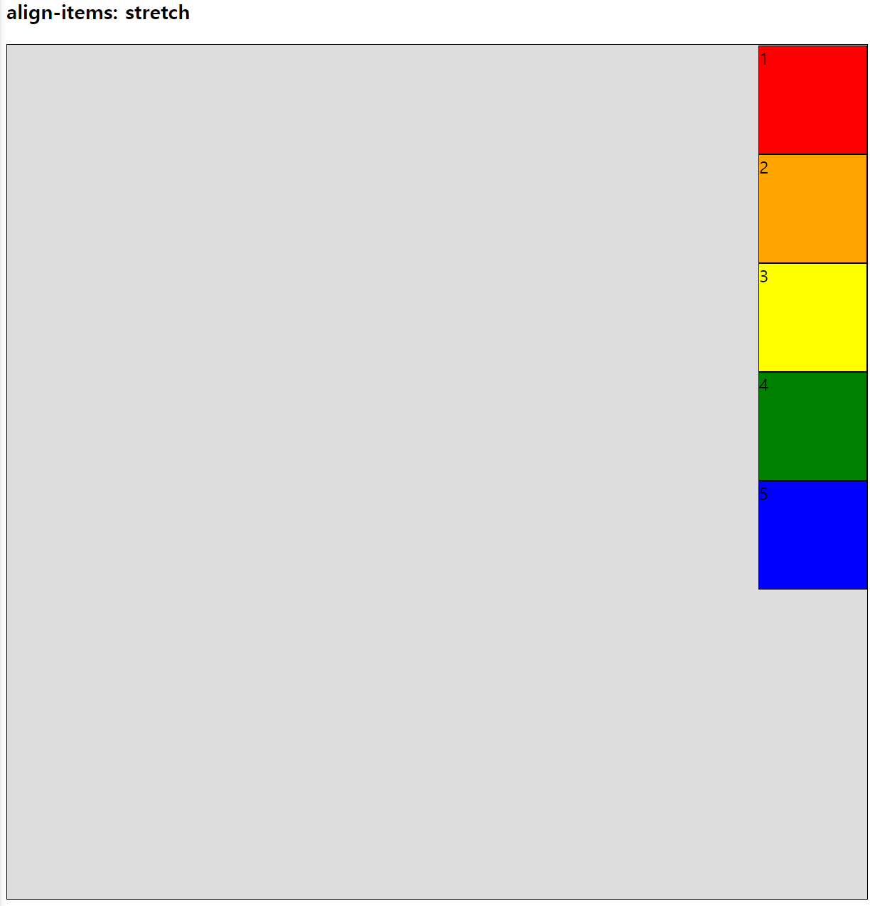

# FlexBox 
> ### 요소가 정렬되는 방향, 순서 요소 간의 간격을 수치적으로 처리하지 않아도 유연하게 처리해줌

## FlexBox 구성
- ### flex-container : 정렬이 필요한 요소를 감싸는 요소
- ### item : 정렬이 필요한 요소(정렬 적용 대상)
- ### FlexBox 축(axis)
  - 중심축(main axis)
  - 교차축, 반대축(cross axis)
- ### *flex-container 속성과 item 속성은 동시에 가질수 있음*

<br>

## flex-container / item 속성들
- ### **flex-container**
    |구분|설명|
    |:--:|:--|
    |[display : flex](#display--flex)|item을 감싸는 요소의 형식을 flex로 변경|
    |[flex-direction](#flex-direction)|main-axis의 방향과 시작 위치를 지정하는 속성|
    |[flex-wrap](#flex-wrap)|item들을 포장하는 속성|
    |[flex-flow](#flex-flow)|flex-direction과 flex-wrap을 한번에 지정하는 속성|
    |[justify-content](#justify-content)|main-axis 방향으로 내용(item)을 정렬하는 방법을 조정하는 속성|
    |[align-items](#align-items)|main-axis에 정렬된 item들을 cross-axis 방향으로 정렬하는 방법을 지정하는 속성|

- ### **item**
    |구분|설명|
    |:--:|:--|
    |[align-content](#align-content)|item이 포장된 한 줄을 단위로 cross-axis 방향으로 배치하는 방법|
    |[order](#order)|item main-axis 방향으로 배치되는 순서를 지정하는 속성|
    |[flex-grow](#flex-grow)|item의 팽창 정도를 지정하는 속성|
    |[flex-shrink](#flex-shrink)|item이 수축하는 정도를 지정하는 속성|
    |[flex-basis](#flex-basis)|main-axis 방향으로 item이 차지하는 크기를 지정하는 속성|
    |[item-flex](#item---flex-속성)|grow + shrink + basis을 한번에 지정|
    |[align-self](#align-self)|각 item별로 교차죽 배치를 지정하는 속성|

<br>

## display : flex
> ### item을 감싸는 요소의 형식을 flex로 변경(flex-container)
> ### item에 자동으로 지정된 margin이 모두 사라짐
> *item에 높이는 flex-container의 너비/높이와 같아짐(main-axis 방향에 따라 다름)*
```html
<h3 class="sticky">display : flex</h3>

<div class="container">
    <div class="div-1">1</div>
    <div class="div-2">2</div>
    <div class="div-3">3</div>
    <div class="div-4">4</div>
    <div class="div-5">5</div>
    <div class="div-6">6</div>
    <div class="div-7">7</div>
</div>
```
```css
.container {
    height: 200vh;
    border: 1px solid black;
    background-color: #ddd;
    display: flex;
}        
.container > div {
    height: 100px;
    width: 100px;
    border: 1px solid black;
}
.div-1 {background-color: red;}
.div-2 {background-color: orange;}
.div-3 {background-color: yellow;}
.div-4 {background-color: green;}
.div-5 {background-color: blue;}
.div-6 {background-color: navy;}
.div-7 {background-color: purple;}
```

<h2><details>
<summary>html</summary>


> ### item에 자동으로 지정된 margin이 사라져 메인축 방향으로 순서대로 정렬
</details></h2>

- ### item요소의 높이가 지정되지 않았다면 flex-container의 높이와 같아짐
  ```css
  .container > div {
    /* height: 100px; */    높이를 지정하지 않음
    width: 100px;
    border: 1px solid black;
  }
  ```
    <h2><details>
    <summary>html</summary>

    
    > ### item요소의 높이가 지정되지 않았다면 flex-container의 높이와 같아짐
    </details></h2>

<br>

## flex-direction
> ### main-axis(메인축)의 방향과 시작 위치를 지정하는 속성
> *가로 방향(행, 기본값), 가로 역방향*  
> *세로 방향(열), 세로 역방향*

- ### flex-direction : row
    > 왼쪽 -> 오른쪽, 가로 방향(행)
    > *기본값*
    ```css
    flex-direction : row
    ```
    <h2><details>
    <summary>html</summary>

    
    > ### 왼쪽 -> 오른쪽, 가로 방향(행)
    </details></h2>


- ### flex-direction : row-reverse
    > 오른쪽 -> 왼쪽, 가로 방향(행)
    ```css
    flex-direction : row-reverse
    ```

    <h2><details>
    <summary>html</summary>

    
    > ### 오른쪽 -> 왼쪽, 가로 방향(행)
    </details></h2>

- ### flex-direction : column
    > 위쪽 -> 아래쪽, 세로 방향(열)
    ```css
    flex-direction : column
    ```

    <h2><details>
    <summary>html</summary>

    
    > ### 위쪽 -> 아래쪽, 세로 방향(열)
    </details></h2>

- ### flex-direction : column-reverse
    > 아래쪽 -> 위쪽, 세로 방향(열)
    ```css
    flex-direction : column-reverse
    ```

    <h2><details>
    <summary>html</summary>

    
    > ### 아래쪽 -> 위쪽, 세로 방향(열)
    </details></h2>

<br>

## flex-wrap
> ### item들을 포장하는 속성

- ### flex-wrap : nowrap
    > item들이 강제로 한 줄에 배치되게 함  
    > *기본값*
    ```css
    flex-wrap: nowrap;
    ```

    <h2><details>
    <summary>html</summary>

    
    </details></h2>

- ### flex-wrap : wrap
    > item을 여러줄로 배치
    ```css
    flex-wrap: wrap;
    ```

    <h2><details>
    <summary>html</summary>

    
    </details></h2>

- ### flex-wrap : wrap-reverse
    > item을 여러줄로 배치(뒤에서부터 배치)
    ```css
    flex-wrap: wrap-reverse;
    ```

    <h2><details>
    <summary>html</summary>

    
    </details></h2>

## flex-flow
> ### flex-direction과 flex-wrap을 한번에 지정하는 속성
> *flex 설계 시 가장 기본인 속성 두가지를 한번에 지정*
```css
flex-flow: /* flex-direction */ /* flex-wrap */;

flex-flow: column nowrap;
flex-flow: row nowrap;
```

<br>

## justify-content
> ### main-axis 방향으로 내용(item)을 정렬하는 방법을 조정하는 속성

- ## justify-content : flex-start
    > main-axis 시작 지점을 기준으로 정렬  
    > *기본값*
    ```css
    justify-content: flex-start;
    ```
    <h3><details>
    <summary>main-axis == row</summary>

    
    </details></h3>

    <h3><details>
    <summary>main-axis == column</summary>

    
    </details></>

- ## justify-content : flex-end
    > main-axis 끝 지점을 기준으로 정렬
    ```css
    justify-content: flex-end;
    ```
    <h3><details>
    <summary>main-axis == row</summary>

    
    </details></h3>
    
    <h3><details>
    <summary>main-axis == column</summary>

    
    </details></h3>

- ## justify-content : center
    > main-axis 중간 지점을 기준으로 정렬
    ```css
    justify-content: center;
    ```
    <h3><details>
    <summary>main-axis == row</summary>

    
    </details></h3>
    
    <h3><details>
    <summary>main-axis == column</summary>

    
    </details></h3>

- ## justify-content : space-around
    > main-axis 방향으로 item 주위에 일정한 크기의 공간을 추가  
    > item들이 간격을 두고 배치
    > *양끝의 간격 제외*
    ```css
    justify-content: space-around;
    ```
    <h3><details>
    <summary>main-axis == row</summary>

    
    </details></h3>
    
    <h3><details>
    <summary>main-axis == column</summary>

    
    </details></h3>

- ## justify-content : space-evenly
    > main-axis 방향으로 동일한 간격을 가짐
    > *양끝의 간격도 동일함*
    ```css
    justify-content: space-evenly;
    ```
    <h3><details>
    <summary>main-axis == row</summary>

    
    </details></h3>
    
    <h3><details>
    <summary>main-axis == column</summary>

    
    </details></h3>

- ## justify-content : space-between
    > 양 끝의 item을 main-axis 시작/끝 지점에 붙임
    > item들이 동일한 간격을 가짐
    ```css
    justify-content: space-between;
    ```
    <h3><details>
    <summary>main-axis == row</summary>

    
    </details></h3>
    
    <h3><details>
    <summary>main-axis == column</summary>

    
    </details></h3>
<br>

## align-items
> ### main-axis에 정렬된 item들을 cross-axis 방향으로 정렬하는 방법을 지정하는 속성

- ## align-items : stretch
    > item에 cross-axis 방향으로 크기 지정이 없을 경우  
    > 감싸고 있는 flex-container의 크기와 같은 크기를 가지도록 늘리는 속성  
    > *기본값*
    ```css
    align-items : stretch;
    ```
    <h3><details>
    <summary>main-axis == row</summary>

    
    </details></h3>
    
    <h3><details>
    <summary>main-axis == column</summary>

    
    </details></h3>

- ## align-items : flex-start
    > item에 cross-axis 방향으로 크기 지정이 없을 경우  
    > 감싸고 있는 flex-container의 크기와 같은 크기를 가지도록 늘리는 속성
    ```css
    align-items : flex-start;
    ```
    <h3><details>
    <summary>main-axis == row</summary>

    
    </details></h3>
    
    <h3><details>
    <summary>main-axis == column</summary>

    
    </details></h3>

- ## align-items : flex-end
    > item에 cross-axis 방향으로 크기 지정이 없을 경우  
    > 감싸고 있는 flex-container의 크기와 같은 크기를 가지도록 늘리는 속성
    ```css
    align-items : flex-end;
    ```
    <h3><details>
    <summary>main-axis == row</summary>

    
    </details></h3>
    
    <h3><details>
    <summary>main-axis == column</summary>

    
    </details></h3>

- ## align-items : center
    > item에 cross-axis 방향으로 크기 지정이 없을 경우  
    > 감싸고 있는 flex-container의 크기와 같은 크기를 가지도록 늘리는 속성
    ```css
    align-items : center;
    ```
    <h3><details>
    <summary>main-axis == row</summary>

    
    </details></h3>
    
    <h3><details>
    <summary>main-axis == column</summary>

    
    </details></h3>

<br>

## align-content
> ### item이 포장된 한 줄을 단위로 cross-axis 방향으로 배치하는 방법
> *속성값은 `justify-content`의 값을 모두 사용 가능*

- ## align-content : flex-start
    > main-axis 시작 지점을 기준으로 정렬  
    > *기본값*
    ```css
    align-content: flex-start;
    ```
    <h3><details>
    <summary>main-axis == row</summary>

    
    </details></h3>

    <h3><details>
    <summary>main-axis == column</summary>

    
    </details></>

- ## align-content : flex-end
    > main-axis 끝 지점을 기준으로 정렬
    ```css
    align-content: flex-end;
    ```
    <h3><details>
    <summary>main-axis == row</summary>

    
    </details></h3>
    
    <h3><details>
    <summary>main-axis == column</summary>

    
    </details></h3>

- ## align-content : center
    > main-axis 중간 지점을 기준으로 정렬
    ```css
    align-content: center;
    ```
    <h3><details>
    <summary>main-axis == row</summary>

    
    </details></h3>
    
    <h3><details>
    <summary>main-axis == column</summary>

    
    </details></h3>

- ## align-content : space-around
    > main-axis 방향으로 item 주위에 일정한 크기의 공간을 추가  
    > item들이 간격을 두고 배치
    > *양끝의 간격 제외*
    ```css
    align-content: space-around;
    ```
    <h3><details>
    <summary>main-axis == row</summary>

    
    </details></h3>
    
    <h3><details>
    <summary>main-axis == column</summary>

    
    </details></h3>

- ## align-content : space-evenly
    > main-axis 방향으로 동일한 간격을 가짐
    > *양끝의 간격도 동일함*
    ```css
    align-content: space-evenly;
    ```
    <h3><details>
    <summary>main-axis == row</summary>

    
    </details></h3>
    
    <h3><details>
    <summary>main-axis == column</summary>

    
    </details></h3>

- ## align-content : space-between
    > 양 끝의 item을 main-axis 시작/끝 지점에 붙임
    > item들이 동일한 간격을 가짐
    ```css
    align-content: space-between;
    ```
    <h3><details>
    <summary>main-axis == row</summary>

    
    </details></h3>
    
    <h3><details>
    <summary>main-axis == column</summary>

    
    </details></h3>

<br>

## order
> ### item main-axis 방향으로 배치되는 순서를 지정하는 속성
```html
<div class="container">
    <div class="div-1 order-3">1</div>
    <div class="div-2 order-1">2</div>
    <div class="div-3 order-5">3</div>
    <div class="div-4 order-2">4</div>
    <div class="div-5 order-4">5</div>
</div>
```
```css
.order-1 { order: 1; }
.order-2 { order: 2; }
.order-3 { order: 3; }
.order-4 { order: 4; }
.order-5 { order: 5; }
```
<h3><details>
<summary>order</summary>


</details></h3>

<br>


## flex-grow
> ### item의 팽창 정도를 지정하는 속성
> ### 여러 item에 지정된 경우 각각의 비율에 맞게 팽창
> *기본값 0*
```html
<div class="container">
    <div class="div-1 grow1">1</div>
    <div class="div-2 grow2">2</div>
    <div class="div-3 grow3">3</div>
    <div class="div-4 grow4">4</div>
</div>
```
```css
.grow1 {flex-grow: 1;}
.grow2 {flex-grow: 2;}
.grow3 {flex-grow: 3;}
.grow4 {flex-grow: 4;}
```
<h3><details>
<summary>flex-grow</summary>


</details></h3>

<br>

## flex-shrink
> ### item이 수축하는 정도를 지정하는 속성
> *기본값 1*
```html
<div class="container">
    <div class="div-1 .shrink0">1</div>
    <div class="div-2 .shrink1">2</div>
    <div class="div-3 .shrink2">3</div>
    <div class="div-4 .shrink3">4</div>
</div>
``` 
```css
.shrink0 {flex-shrink: 0;}
.shrink1 {flex-shrink: 1;}
.shrink2 {flex-shrink: 2;}
.shrink3 {flex-shrink: 3;}
```
<h3><details>
<summary>flex-shrink</summary>


</details></h3>

<br>

## flex-basis
> ### main-axis 방향으로 item이 차지하는 크기를 지정하는 속성
```html
<div class="container">
    <div class="div-1 b-150px">1</div>
    <div class="div-2 b-10p">2</div>
    <div class="div-3 b-25p">3</div>
    <div class="div-4 b-50p">4</div>
</div>
```
```css
.b-150px{ flex-basis: 150px; }
.b-10p  { flex-basis: 10%; }
.b-25p  { flex-basis: 25%; }
.b-50p  { flex-basis: 50%; }
```

<h3><details>
<summary>main-axis == row</summary>


</details></h3>

<h3><details>
<summary>main-axis == column</summary>


</details></h3>

<br>

## item - flex 속성
> ### grow + shrink + basis을 한번에 지정

```css
.item {
    flex-grow : 1;
    flex-shrink: 1;
    flex-basis: 0;

    flex: 1 1 0;  /* 위와 동일 */
    flex: 1 /* 1 1 0, 위와 동일 */
}
```

<br>

## align-self
> ### 각 item별로 교차죽 배치를 지정하는 속성
```html
<div class="container">
    <div class="div-1 start">1</div>
    <div class="div-2 end">2</div>
    <div class="div-3 center">3</div>
</div>
```

```css
.start{ align-self: flex-start;}
.end{ align-self: flex-end;}
.center{ align-self: center;}
```

<h3><details>
<summary>main-axis == row</summary>


</details></h3>

<h3><details>
<summary>main-axis == column</summary>


</details></h3>