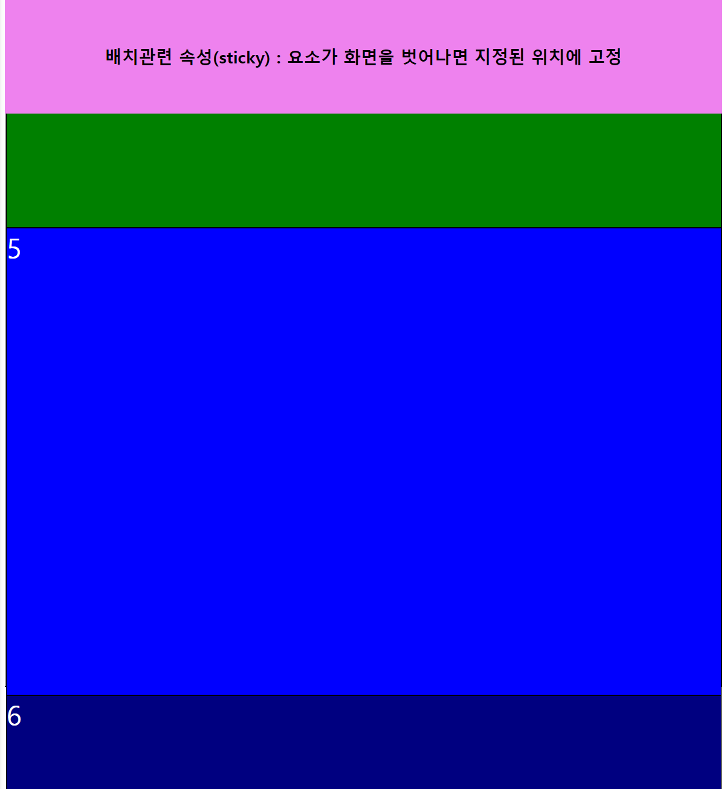

# 레이아웃(layout)
> ### 사전적 의미 : 배치, 정리
> ### 기술적 의미 : **구성 요소를 제한된 공간에 효율적으로 배치 하는 것**

<br>


## 화면 배치 방법(형식) : display
> ### 요소가 화면에 어떻게 보여질지 형식을 지정하는 속성
- ### display : block;
    > 화면을 수직 분할(행을 나눔)  
    > *width, height* 사용가능
    ```html
    <h3>inline 형식의 요소(span)를 block으로 변경</h3>
    <span>1번 영역</span>
    <span>2번 영역</span>
    <span>3번 영역</span>
    ```
    ```css
    span {
        display : block;
        width: 100px;
        height : 100px;
        border : 1px solid black;
    } /* inline 형식의 span태그를 block형식으로 변경 */
    ```
    <h2><details>
    <summary>html</summary>

    
    > ### inline형식의 span 태그가 block형식으로 변경되어 width, height를 가질 수 있음
    </details></h2>

- ### display : inline;
    > 화면을 수평 분할(한 행의 열(컬럼)을 나눔)  
    > *width, height* 사용불가 
    ```html
    <h3>block 형식의 요소(div)를 inline으로 변경</h3>
    <div>1번 영역</div>
    <div>2번 영역</div>
    <div>3번 영역</div>
    ```
    ```css
    div {
        display: inline;
        width: 100px;
        height : 100px;
    } /* block 형식의 요소(div)를 inline으로 변경 */
    ```
    <h2><details>
    <summary>html</summary>

    
    > ### block형식의 div 태그가 inline형식으로 변경되어 width, height를 가질 수 없음
    </details></h2>

- ### display : inline-block
    > inline의 수평 분할 + block의 크기 조절
    ```html
    <h3>inline의 수평 분할 + block의 크기 조절</h3>
    <span class="inline-block">1번 영역</span>
    <div class="inline-block">2번 영역</div>
    ```
    ```css
    .inline-block{
        display: inline-block;
        width: 100px;
        height: 100px;
        border: 1px solid black;
    } /* inline의 수평 분할 + block의 크기 조절 */
    ```

    <h2><details>
    <summary>html</summary>

    
    > ### div는 수평분할이 가능하고, span은 width, height를 가질 수 있게 됨
    </details></h2>

- ### display : none
    > 화면에 요소가 표시되지 않지만 존재하는 하고 있는 상태
    > *공간을 차지하지 않음*
    ```html
    <h3>display : none</h3>
    <div class="test4">1</div>
    <div class="test4 none">2</div>
    <div class="test4">3</div>
    ```
    ```css
    div {
        width: 100px;
        height: 100px;
        border: 1px solid black;
    }
    .none{
        display: none;
    } /* 화면에 요소가 표시되지 않지만 존재하는 하고 있는 상태 */
    ```
    <h2><details>
    <summary>html</summary>

    
    > ### 화면에는 1, 3밖에 보여지지 않지만 존재하고 있음
    </details></h2>

  - ### display : none / visibility : hidden 차이점
    ```html
    <h3>display : none / visibility : hidden 차이점</h3>
    <div class="test4">1</div>
    <div class="test4 none">2</div>
    <div class="test4">3</div>
    <div class="test4 hidden">4</div>
    <div class="test4">5</div>
    ```
    ```css
    div {
        width: 100px;
        height: 100px;
        border: 1px solid black;
    }
    .none{
        display: none;
    }
    .hidden {
        visibility : hidden;
    } /* 요소를 투명한 상태로 표시 */
    ```
    <h2><details>
    <summary>html</summary>

    
    > ### `display:none`은 공간을 차지 하지 않지만, `visibility:hidden;`은 3과5 사이에 공간을 차지하고 있다.
    </details></h2>

- ### display : flex

<br>

## 요소의 영역(여백) 관련 속성
> ### 모든 html 요소는 총 **4가지의 영역**으로 구성

- ### content 영역
    > 요소의 내용이 작성되어지는 영역  
    > *시작, 중료 태그 사이에 작성되는 내용이 출력되는 영역*  
    > *width, height : (기본적으로) content 영역의 크기를 지정*
    ```html
    <div>요소의 내용이 작성되어지는 영역 시작, 중료 태그 사이에 작성되는 내용이 출력되는 영역</div>
    ```
    ```css
    div{
        border: 1px solid black;
        width: 150px;
        height: 150px;
    }
    ```
    <h2><details>
    <summary>html</summary>

    
    > `width`, `height` 속성을 통해 content 영역의 크기를 지정
    </details></h2>

- ### border 영역
    > 요소의 테두리가 지정되는 영역  
    > content보다 바깥쪽을 감싸고 있음
    ```html
    <div class="box border">요소의 테두리가 지정되는 영역</div>
    ```
    ```css
    .box{
        width: 100px;
        height: 100px;
        background-color: skyblue;
    }
    .border{
        border-width: 10px;
        border-style: solid;
        border-color: red;
    
        border-top: 20px solid blue;
        border-right: 5px dotted green;
        border-bottom: 10px double orange;
        border-left: 15px dashed yellowgreen;
    }
    ```
    <h2><details>
    <summary>html</summary>

    
    > ### box의 크기는 content + border
    </details></h2>

- ### padding 영역
    > content와 border 사이의 영역
    ```html
    <div class="box border padding">content와 border 사이의 영역</div>
    ```
    ```css
    .box{
        width: 100px;
        height: 100px;
        background-color: skyblue;
    }
    .border{
        border-width: 10px;
        border-style: solid;
        border-color: red;
    
        border-top: 20px solid blue;
        border-right: 5px dotted green;
        border-bottom: 10px double orange;
        border-left: 15px dashed yellowgreen;
    }
    .padding {
        padding: 100px 50px 20px 30px; /* 상, 우, 하, 좌 */ 
    }
    ```
    <h2><details>
    <summary>html</summary>

    
    > ### box의 크기는 content + border + padding
    </details></h2>

- ### margin
    > 다른 요소와의 간격을 지정하는 영역
    > *block형식의 요소들은 margin을 사용하여 공간을 차지*
    ```html
    <div class="box margin" id="m1">박스2</div>
    <div class="box margin" id="m2">박스1</div>
    ```
    ```css
    .box{
        width: 100px;
        height: 100px;
        background-color: skyblue;
    }
    .margin {
        margin: 50px;
    }
    #m2 {
        margin-top: 100px;
    } /* 두 요소 사이에 모두 margin이 존재하는 경우 간격이 더 넓은 요소의 margin 적용 */
    ```
    <h2><details>
    <summary>html</summary>

    
    > #### 박스1, 박스2 사이의 margin은 간격이 더 넓은 `margin-top : 100px` 적용
    </details></h2>

- ### box-sizing
    > `width` / `height` 속성이 적용되는 범위를 지정하는 속성

    - ### box-sizing : content-box
        > width / height 적용 범위를 **content영역으로 한정**
        > *기본값*
    - ### box-sizing : border-box
        > content + padding + border 의 합이 W/H와 같게 content 비율 자동 조정
    ```html
    <div id="test-box">test 박스 입니다.</div>
    <div id="test-box2">test 박스 입니다.</div>
    ```
    ```css
    #test-box {
        background-color: yellowgreen;
        width: 200px;
        height: 200px;    
        border: 10px solid black;
        padding: 50px;

        box-sizing: content-box; /* 기본값 생략 가능 */
    }
    #test-box2 {
        background-color: seagreen;
        width: 200px;
        height: 200px;
        border: 10px solid black;
        padding: 50px;
    
        box-sizing: border-box; /* content의 크기가 80 x 80으로 조정됨 */
    }
    ```
    <h2><details>
    <summary>html</summary>

    
    > #### 박스1은 border, padding으로 인해 지정한 w/h보다 크기가 커졌지만, 박스2는 w/h에 맞게 content영역의 크기가 조정됨
    </details></h2>

- ### 요소의 영역 정리
    |구분|설명|가시여부|
    |:--:|:--|:--:|
    |content|요소의 내용이 작성되어지는 영역<br>(시작, 종료 태그 사이에 작성되는 내용이 출력되는 영역)|O|
    |border|요소의 테두리가 지정되는 영역|O|
    |padding|content와 border 사이의 영역|O|
    |margin|다른 요소와의 간격을 지정하는 영역|O|

<br>

## 요소 정렬 스타일(float / clear)
- ### float
    > 요소를 띄워서 좌/우로 정렬하는 속성

- ### clear
    > float로 인해 띄워져 있는 상태를 해제하는 속성  
    > clear시 아래 요소들도 같이 clear  
    > *float 사용 시 겹침 문제 발생, 이를 해결할 때 사용*
    ```html
    <h3>float / clear</h3>
    <div class="test">
        <div class="left">1</div>
        <div class="left">2</div>
        <div class="left">3</div>
        <div class="left">4</div>
        <div class="clear-right">Hello</div>
        <div class="clear-left">World</div>
        <div class="clear-both">HTML</div>
        <div class="left">5</div>
        <div class="left">6</div>
    </div>
    ```
    ```css
    .test {
        width: 300px;
        height: 200px;
        background-color: #ddd;
    }
    .left {
        width: 50px;
        height: 50px;
        background-color: pink;
        
        float: left;
    }
    .clear-left { clear : left; } /* float : left 상태를 해제 */
    .claer-right { clear : right; } /* float : right 상태를 해제 */
    .clear-both { clear : both; } /* left/right 상태를 동시에 해제 */
    ```
    <h2><details>
    <summary>html</summary>

    
    > #### `float:left` 속성을 가진 요소들이 레이어를 무시하고 왼쪽 정렬
    > #### `clear:right` 속성을 가진 Hello는 float상태를 해제하지 못함
    </details></h2>
<br>

## 배치 관련 스타일(position)
> ### 요소의 위치를 지정하는 속성

- ### position : relative(상대적인)
    > 지정된 요소 내부에 다른 요소가 상대적인 위치를 지정할 수 있도록 **기준이 되게 만드는 속성**
    
- ### position : absolute
    > 기본 요소의 배치 순서를 무시하고 **지정된 절대 위치**에 요소를 배치  
    > *지정된 절대 위치* : 가장 가까운 부모 relative 박스(없으면 body)
    ```html
    <h3>배치관련 속성(position)</h3>

    <div class="container">
        <div class="div-1">div1</div>
        <div class="div-2">div2</div>
        <div class="div-3">div3</div>
    </div>
    ```
    ```css
    .container {
        border: 1px solid black;
        width: 600px;
        height: 600px;
        position: relative; /* 내부 position:absolute인 요소들의 기준점이 됨*/
    }
    .container > div {
        border: 1px solid black;
        width: 100px;
        height: 100px;
        position: absolute;
    }
    .div-1 {
        top: 50px; /* 기준의 맨 위에서부터 50px 떨어진 위치 */
    }
    .div-2 {
        top: 100px; /* 기준의 맨 위에서부터 100px 떨어진 위치*/
        left: 200px; /* 기준의 맨 왼쪽에서부터 200px 떨어진 위치*/
    }
    .div-3 {
        bottom: 100px; /* 기준의 맨 아래에서부터 100px 떨어진 위치 */
        right: 300px; /* 기준의 맨 오른쪽에서부터 300px 떨어진 위치 */
    }
    ```

    <h2><details>
    <summary>html</summary>

    
    > ### layout을 무시하고 절대적인 위치에 요소 배치
    </details></h2>

- ### position : fixed
    > 항상 고정된 위치에 요소를 배치
    ```html
    <h3>배치관련 속성(position)</h3>

    <div class="container">
        <div class="div-1">1</div>
        <div class="div-2">2</div>
        <div class="div-3">3</div>
        <div class="div-4">4</div>
        <div class="div-5">5</div>
        <div class="div-6">6</div>
        <div class="div-7">7</div>
    </div>
    <div class="fixed">고정 요소(fixed)</div>
    ```
    ```css
    .container {
        height: 200vh;
        border: 1px solid black;
    }        
    .container > div {
        height: 20%;
        border: 1px solid black;
        font-size: 30px;
        color: white;
    }
    .div-1 {background-color: red;}
    .div-2 {background-color: orange;}
    .div-3 {background-color: yellow;}
    .div-4 {background-color: green;}
    .div-5 {background-color: blue;}
    .div-6 {background-color: navy;}
    .div-7 {background-color: purple;}
    .fixed {    
        position: fixed;
        top: 20px;
        right: 100px;
        border: 2px solid black;    
        background-color: black;
        color: white;
        width: 300px;
        height: 300px;
    }
    ```

    <h2><details>
    <summary>pixed-1</summary>

    
    > ### 레이아웃을 무시하고 지정된 위치에 고정
    </details></h2>

    <h2><details>
    <summary>pixed-2</summary>

    
    > ### 스크롤을 내려도 화면에 지정된 위치 고정
    </details></h2>

- ### position : sticky
    > 요소가 화면을 벗어났을 때 화면에 붙여 고정된 위치를 가지게 만듦
    > *fixed의 응용버전*
    ```html 
    <h3>배치관련 속성(position)</h3>

    <div class="container">
        <div class="div-1">1</div>
        <div class="div-2">2</div>
        <div class="div-3">3</div>
        <div class="div-4">4</div>
        <div class="div-5">5</div>
        <div class="div-6">6</div>
        <div class="div-7">7</div>
    </div>
    ```
    ```css
    .container {
        height: 200vh;
        border: 1px solid black;
    }        
    .container > div {
        height: 20%;
        border: 1px solid black;
        font-size: 30px;
        color: white;
    }
    .div-1 {background-color: red;}
    .div-2 {background-color: orange;}
    .div-3 {background-color: yellow;}
    .div-4 {background-color: green;}
    .div-5 {background-color: blue;}
    .div-6 {background-color: navy;}
    .div-7 {background-color: purple;}
    .sticky {
        border: 1px solid violet;
        position: sticky;
        height: 150px;
        text-align: center;
        box-sizing: border-box;
        padding: 75px;
        top: -25px;
        background-color: violet;
    }
    ```

    <h2><details>
    <summary>sticky-1</summary>

    
    </details></h2>

    <h2><details>
    <summary>sticky-2</summary>

    
    > ### 요소가 화면을 벗어났을 때 지정된 위치(top : -32)에 고정됨
    </details></h2>

<br>
